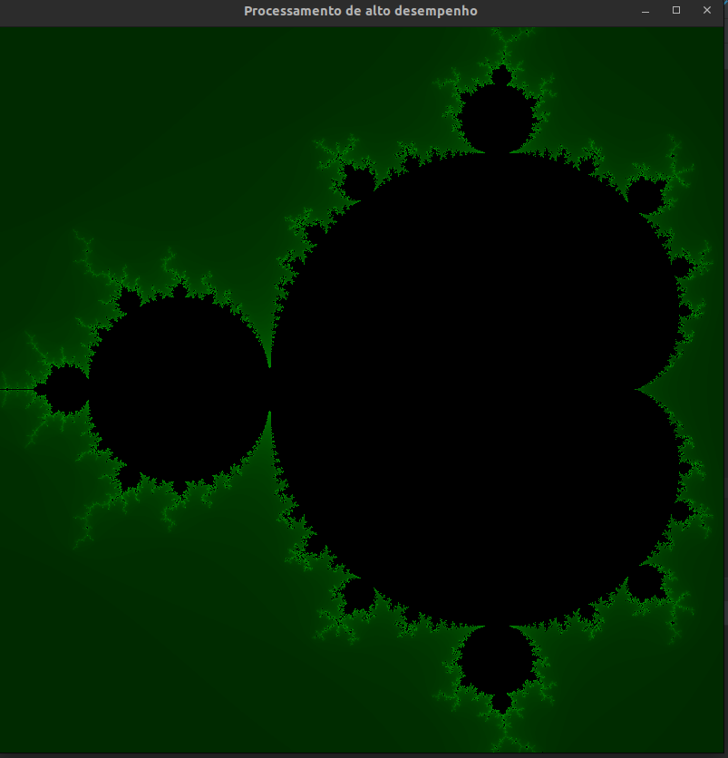
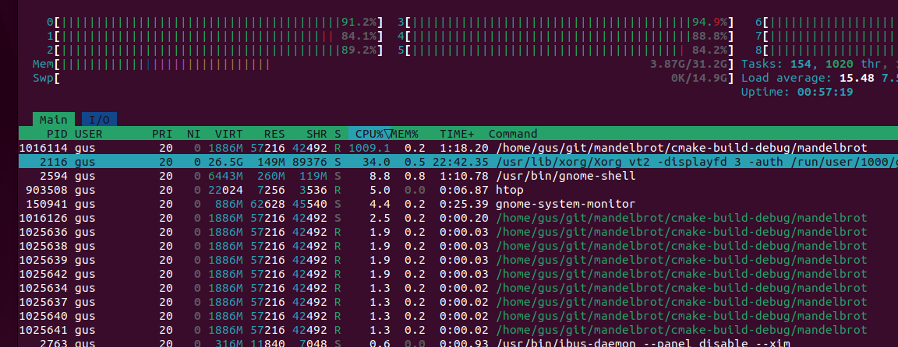
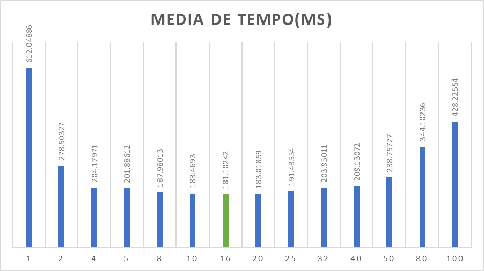
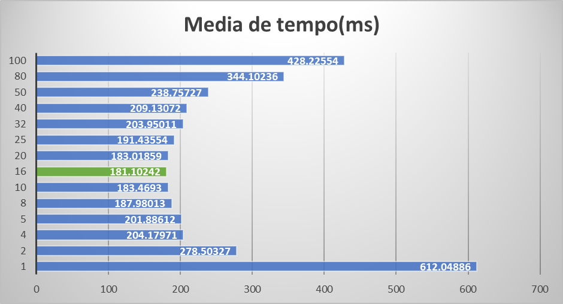

# Mandelbrot



## Requisitos
Estar em um ambiente linux, de prefêrencia da fámilia Debian/Ubuntu.

## Dependencias
Rodar o seguinte código no seu terminal linux para instalar as bibliotecas necessárias, caso não estejam instaladas.
Esse comando é usado para distros "Debian", caso tiver uma distro baseado em outra familia, pesquisar o instalador de pacotes da sua distro
```shell
    sudo apt-get install build-essential libglu1-mesa-dev freeglut3-dev mesa-common-dev mesa-utils libglfw3-dev libglew-dev cmake
```

### Movimentos

Utilize 8,6,4,2 para movimentar o canvas


### Como executar o programa?

Opção 1) Utilizar uma IDE (Ex: CLion) para execução

Opção 2)

```terminal
cd cmake-build-debug
./madelbrot
```

### Analise das threads:

https://github.com/htop-dev/htop



### Qual a Melhor quantidade de threads? E Por que?

16.

Para a avaliação da melhor quantidade de threads do programa, foi executado 100 simulações para cada possibilidade de quantidade de threads, considerando o máximo de 100 threads. Segue abaixo o resultado com a média do tempo para cada quantidade de thread:




Obs: Por nossa tela ter tamanho de 800x800, só utilizamos quantidades de threads multiplas de 800.

Para mais detalhes, pode ser verificado o excel Analise-quantidade-de-threads.xlsx

Vale ressaltar que cada máquina pode ter um desempenho diferente e uma resposta diferente, pois existem diversos fatores que podem influenciar tal resultado, como por exemplo o hardware disponivel na máquina.


